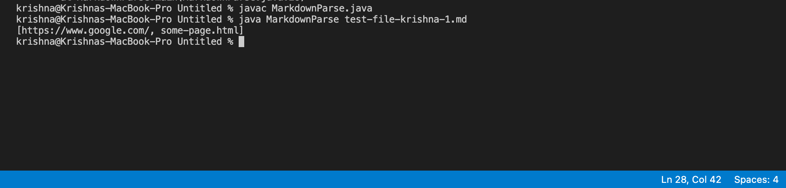
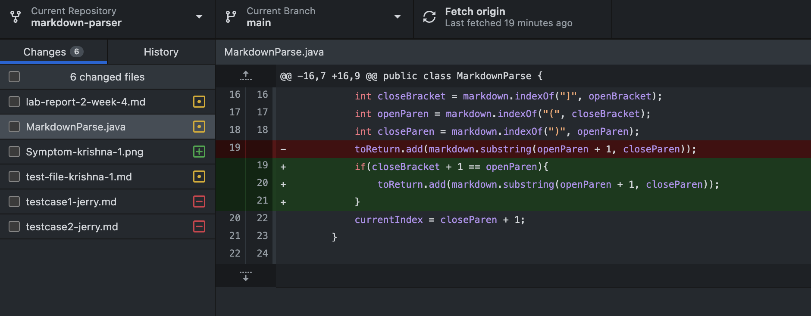
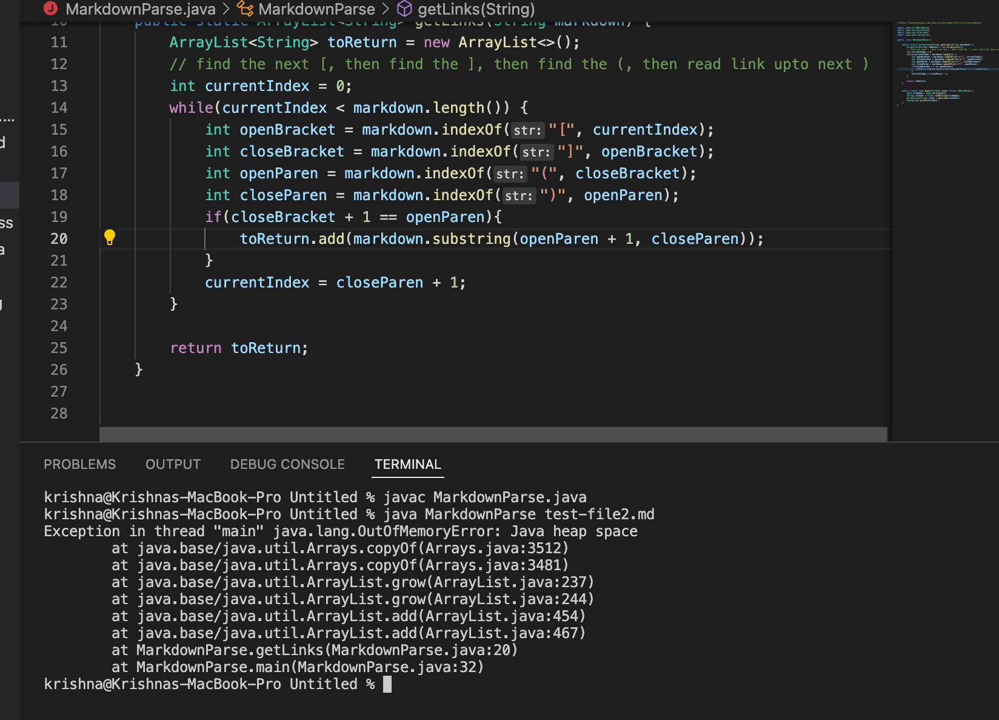
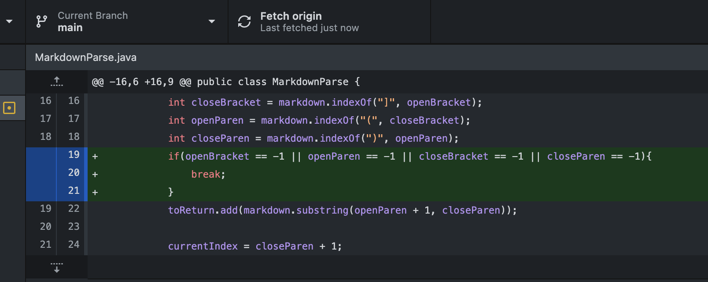
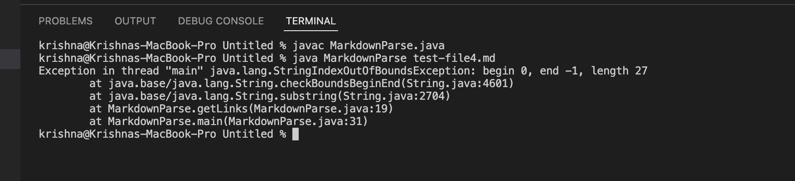

# **CSE 15L Lab Report 2**
## Krishna Reddy
*****

## **Words between the links:**

[Failure-Inducing Input](test-file-krishna-1.md) for words in between the link

**Symptom:**



**Changing the Code:**



The faliure-inducing input here is a file where there are some random words in between the closing square bracket of the file link and it's open parenthesis. Since there are words here and it is not the correct syntax we should see only one link but we do see two of them when we look for symptoms. So, we change the code and add an ```if``` statement to make sure that the opening parenthesis is right after the closing square bracket. Now, we will get our desired output.

*******

## **Words after the link at the end:**

[Failure-Inducing Input](test-file2.md) for text after links in the file

**Symptom:**



**Changing the Code:**



The faliure-inducing input here is a file where there is some text after the last link. This causes a problem as the `while` loop will keep running infinitely many times because the file doesn't end with a link. This throws the program into an infinite loop which eventually causes the program to crash. To fix this, I have an added an if statement that checks for the link at the end, if any of the opening, closing brackets or parenthesis are not found, which will then have a value of -1, then the program will break out of the `while` loop.

*******

## **File with only text and no links:**

[Failure-Inducing input](test-file4.md) for no links in the file

**Symptom:**



**Changing the Code:**


The failure-inducing input here is a file where there is only text and no links. Here, we get a `IndexOutOfBounds` exception because because `indexOf` returns a value of -1 because the links are not found. We can use the same code fix as above to fix this as if we use `if` statements to look for the brackets and parentheses and if the parentheses are not found that means that this is not correct syntax. If the syntax isn't correct there is no reason for us to add anything to what we're printing regardless of if there is a link or not. Here, we can clearly see that one bug can cause two symptoms. 


******
